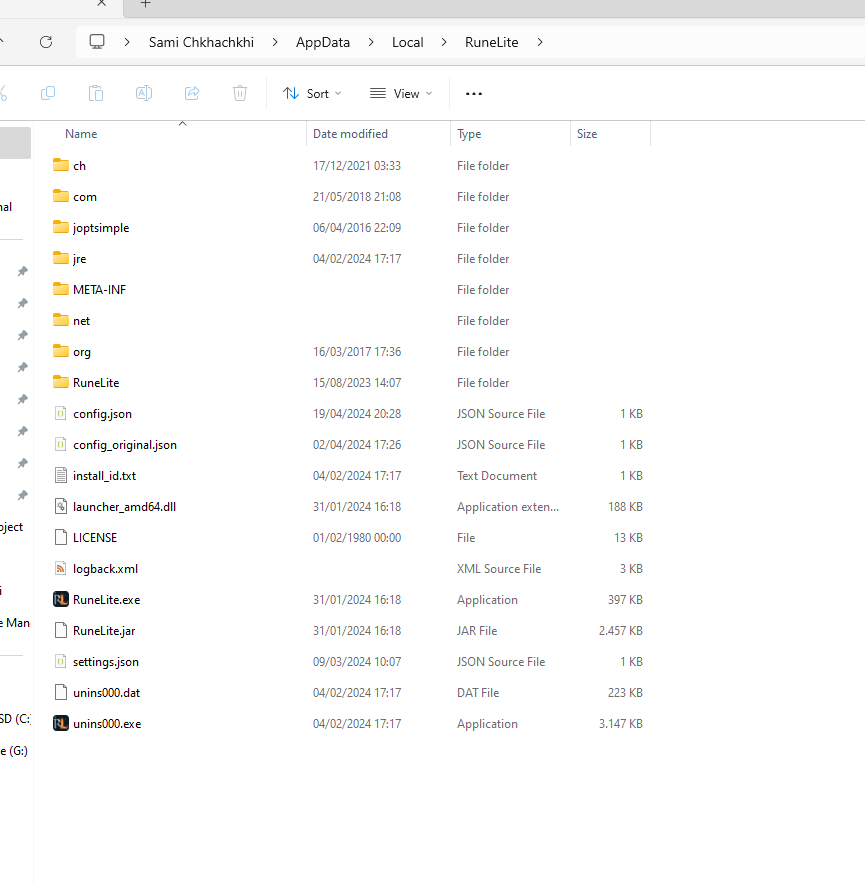
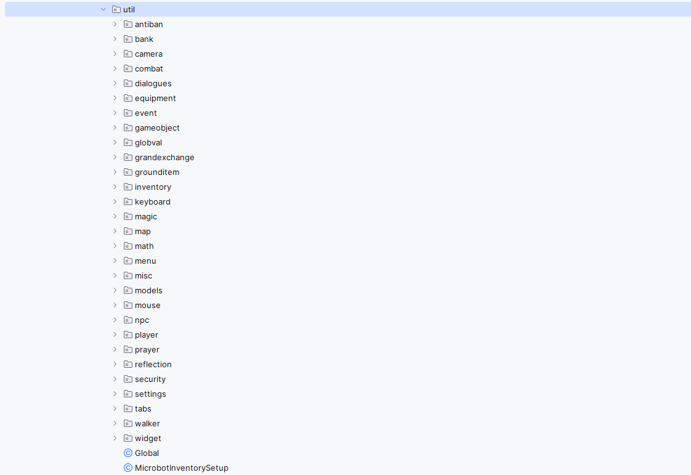
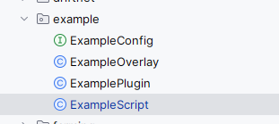

# Microbot
Microbot is an opensource automated oldschool runescape client based on runelite. It uses a plugin system to enable scripting. Here is a youtube channel showing off some of the scripts

[Youtube Channel](https://www.youtube.com/channel/UCEj_7N5OPJkdDi0VTMOJOpw)
 
If you have any questions, please join our [Discord](https://discord.gg/zaGrfqFEWE) server.


## ☕ Buy Me a Coffee

If you enjoy my open source work and would like to support me, consider buying me a coffee! Your support helps me stay caffeinated and motivated to keep improving and creating awesome projects.

[](https://www.paypal.com/paypalme/MicrobotBE?country.x=BE&locale.x=nl_NL)

Thank you for your support! 😊


# I Want To Bot

## Non jagex account

Here is a youtube video on how to setup the bot from scratch for **NON-JAGEX ACCOUNTS**

https://www.youtube.com/watch?v=EbtdZnxq5iw

## Jagex Account

Follow the runelite wiki for setting up jagex accounts: https://github.com/runelite/runelite/wiki/Using-Jagex-Accounts

After you've done setting it up follow these two steps:

1) Simply login with the jagex launcher for the first time. This will create a token for your account. Close everything after succesfully login in through the jagex launcher. 
2) Open the microbot.jar from microbot and this should prompt you with the jagex account to login.

## Jagex Launcher

**Disclaimer:** Before you can do this step, you need to have done the following guide: https://github.com/runelite/runelite/wiki/Using-Jagex-Accounts

Simply replace the Official RuneLite.jar with the microbot.jar and make sure the name is the same!! After that you can start up the jagex launcher and select runelite, this will startup microbot.



# I Want To Develop

## First Time Running the project as a Developer?

Make sure to follow this guide if it's your first time running the project

https://github.com/runelite/runelite/wiki/Building-with-IntelliJ-IDEA


## Project Layout

Under the Microbot Plugin you'll find a util folder that has all the utility classes which make it easier to interact with the game

Utility Classes are prefixed with Rs2. So for player it is Rs2Player. Npcs is Rs2Npc and so on...

If you can't find a specific thing in a utility class you can always call the Microbot object which has access to every object runelite exposes. So to get the location of a player you can do

```java 
Microbot.getClient().getLocalPlayer().getWorldLocation()
```




## ExampleScript

There is an example script which you can use to play around with the api.



How does the example script look like?

```java
public class ExampleScript extends Script {
public static double version = 1.0;

    public boolean run(ExampleConfig config) {
        Microbot.enableAutoRunOn = false;
        mainScheduledFuture = scheduledExecutorService.scheduleWithFixedDelay(() -> {
            if (!super.run()) return;
            try {
                /*
                 * Important classes:
                 * Inventory
                 * Rs2GameObject
                 * Rs2GroundObject
                 * Rs2NPC
                 * Rs2Bank
                 * etc...
                 */

                long startTime = System.currentTimeMillis();
                
                //YOUR CODE COMES HERE
                Rs2Npc.attack("guard");
                
                long endTime = System.currentTimeMillis();
                long totalTime = endTime - startTime;
                System.out.println("Total time for loop " + totalTime);

            } catch (Exception ex) {
                System.out.println(ex.getMessage());
            }
        }, 0, 2000, TimeUnit.MILLISECONDS);
        return true;
    }

    @Override
    public void shutdown() {
        super.shutdown();
    }
}
```

All our scripts exist of Config. This is the settings for a specific script
Overlay, this is a visual overlay for a specific script
Plugin which handles the code for starting and stopping the script
Script which handles all of the code the bot has to execute.

Inside the startup of a plugin we can call the script code like this:

```java
@Override
protected void startUp() throws AWTException {
if (overlayManager != null) {
overlayManager.add(exampleOverlay);
}
//CALL YOUR SCRIPT.RUN
exampleScript.run(config);
}
```

Credits to runelite for making all of this possible <3

https://github.com/runelite/runelite

### License

RuneLite is licensed under the BSD 2-clause license. See the license header in the respective file to be sure.

