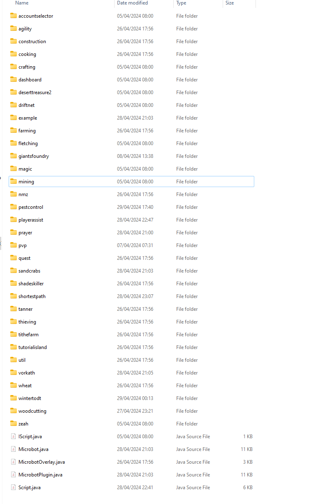
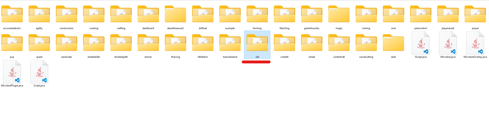
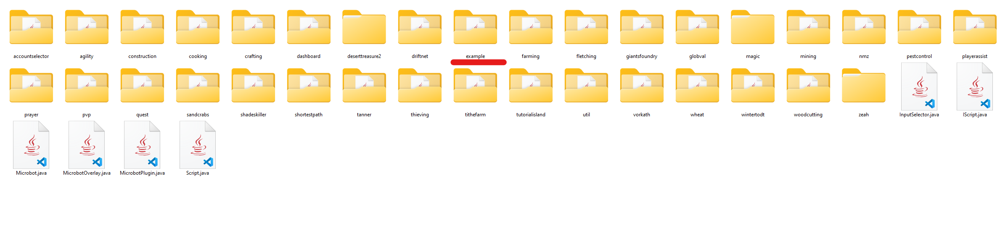
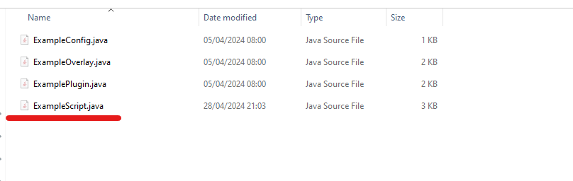
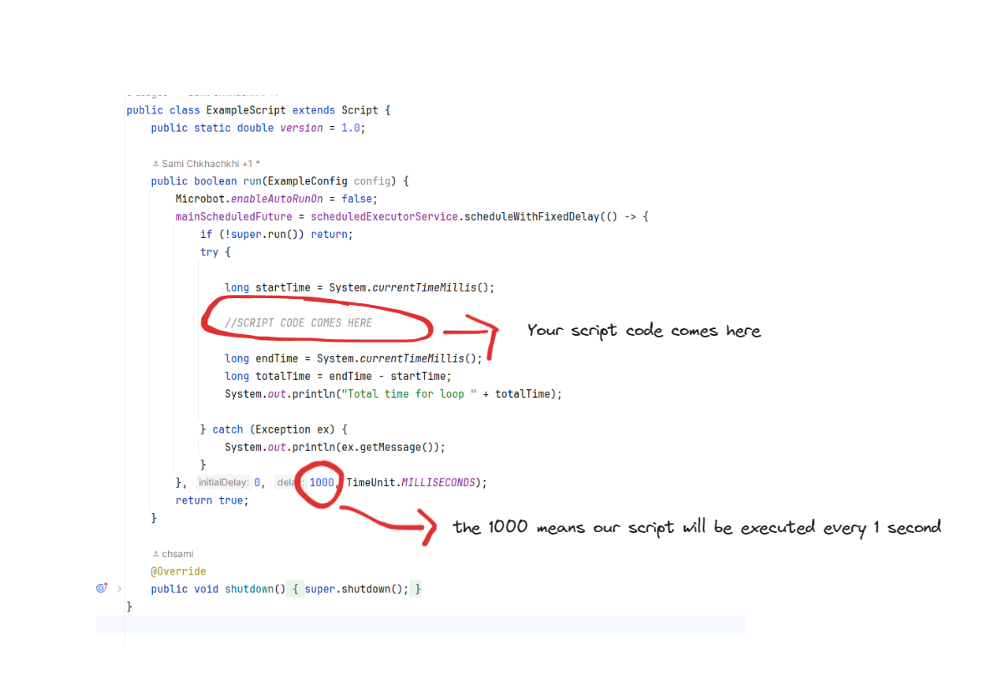
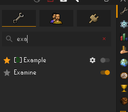
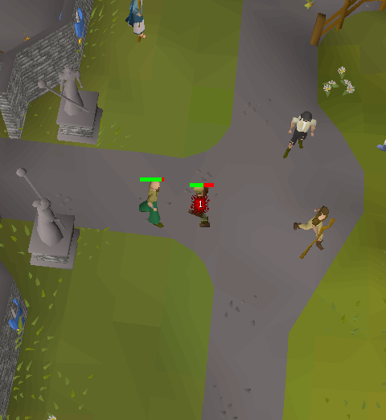

# Development

---

## Setup development environment

---

Since Microbot is a fork of runelite you can simply follow the runelite wiki on how to use intelij to setup a development environment

https://github.com/runelite/runelite/wiki/Building-with-IntelliJ-IDEA

## Project Structure

---

Everything about microbot can be found in the plugin folder called "microbot"

**runelite-client\src\main\java\net\runelite\client\plugins\microbot**



Everything that will help you make scripts is under the **util** folder



## API

Everything that will help you make scripts is under the **util** folder

### [Rs2Bank](api/Rs2Bank.md)
### [Rs2Camera](api/Rs2Camera.md)
### [Rs2Combat](api/Rs2Combat.md)
### [Rs2Dialogue](api/Rs2Dialogue.md)
### [Rs2Equipment](api/Rs2Equipment.md)
### [Rs2Cannon](api/Rs2Cannon.md)
### [Rs2GameObject](api/Rs2GameObject.md)
### [Rs2GroundItem](api/Rs2GroundItem.md)
### [Rs2Inventory](api/Rs2Inventory.md)
### [Rs2Keyboard](api/Rs2Keyboard.md)
### [Rs2Magic](api/Rs2Magic.md)
### [Rs2Spells](api/Rs2Spells.md)
### [Rs2Food](api/Rs2Food.md)
### [Rs2Npc](api/Rs2Npc.md)
### [Rs2Player](api/Rs2Player.md)
### [Rs2Pvp](api/Rs2Pvp.md)
### [Rs2Prayer](api/Rs2Prayer.md)
### [Rs2Reflection](api/Rs2Reflection.md)
### [Rs2Settings](api/Rs2Settings.md)
### [Rs2Tab](api/Rs2Tab.md)
### [Rs2Walker](api/Rs2Walker.md)
### [Rs2MiniMap](api/Rs2MiniMap.md)
### [Rs2Widget](api/Rs2Widget.md)
### [Rs2Tile](api/Rs2Tile.md)

---

## Examples

Inside the microbot plugin folder you'll see a folder called "example"



You can open the examplescript.java. This is the main file we'll be working in.



### Combat

---

Lets try to make a script that attacks a man.



To attack an npc we'll have to look into our Rs2Npc utility class.


```java
Rs2Npc.attack("man");
```

Our example script should look like this now.

```java
public class ExampleScript extends Script {
    public static double version = 1.0;

    public boolean run(ExampleConfig config) {
        Microbot.enableAutoRunOn = false;
        mainScheduledFuture = scheduledExecutorService.scheduleWithFixedDelay(() -> {
            if (!super.run()) return;
            try {

                long startTime = System.currentTimeMillis();

                //SCRIPT CODE COMES HERE
                Rs2Npc.attack("man");
                
                long endTime = System.currentTimeMillis();
                long totalTime = endTime - startTime;
                System.out.println("Total time for loop " + totalTime);

            } catch (Exception ex) {
                System.out.println(ex.getMessage());
            }
        }, 0, 1000, TimeUnit.MILLISECONDS);
        return true;
    }

    @Override
    public void shutdown() {
        super.shutdown();
    }
}
```

The script should now attack the man when you turn on the "example" plugin





Congratulations, you just made a simple auto fighter! 🥳🥳

### Skills

#### Fishing Script Example

```java
package net.runelite.client.plugins.nateplugins.skilling.natefishing;

import net.runelite.api.NPC;
import net.runelite.client.plugins.microbot.Microbot;
import net.runelite.client.plugins.microbot.Script;
import net.runelite.client.plugins.microbot.util.camera.Rs2Camera;
import net.runelite.client.plugins.microbot.util.inventory.Rs2Inventory;
import net.runelite.client.plugins.microbot.util.math.Random;
import net.runelite.client.plugins.microbot.util.npc.Rs2Npc;
import net.runelite.client.plugins.microbot.util.player.Rs2Player;

import java.util.concurrent.TimeUnit;

import static net.runelite.client.plugins.microbot.util.npc.Rs2Npc.validateInteractable;


public class FishingScript extends Script {

    public static double version = 1.3;

    public boolean run(FishingConfig config) {
        mainScheduledFuture = scheduledExecutorService.scheduleWithFixedDelay(() -> {
            if (!super.run()) return;

            try {
                if (Rs2Player.isMoving() || Rs2Player.isAnimating()) {
                    return;
                }
                if (Random.random(1, 300) == 2) {
                    Microbot.pauseAllScripts = true;
                    if (Random.random(1, 10) > 7)
                        Rs2Player.logout();
                    sleep(60000, 600000);
                    Microbot.pauseAllScripts = false;
                    return;
                }
                if (Rs2Inventory.isFull()) {
                    if (config.Fish().getName().equals("shrimp")) {
                        Rs2Inventory.dropAll(x -> x.slot > 0);
                    } else {
                        Rs2Inventory.dropAll(x -> x.slot > 4);
                    }

                } else {
                    for (int fishingSpotId :
                            config.Fish().getFishingSpot()) {
                        NPC fishingspot = Rs2Npc.getNpc(fishingSpotId);
                        if (fishingspot != null && !Rs2Camera.isTileOnScreen(fishingspot.getLocalLocation())) {
                            validateInteractable(fishingspot);
                        }
                        Rs2Npc.interact(fishingSpotId, config.Fish().getAction());
                        Microbot.status = "Fishing...";
                    }

                }

            } catch (Exception ex) {
                System.out.println(ex.getMessage());
            }
        }, 0, 1000, TimeUnit.MILLISECONDS);
        return true;
    }
}

```

### Utility

#### Alching

```java
// Depending on your magic level it will choose low/high alch
Rs2Magic.alch("Rune Platelegs");

```

### Drawing

Coming soon!

### UI Configs

Coming soon!

---

**Are you stuck? Join our [Discord](https://discord.gg/zaGrfqFEWE) server.**

