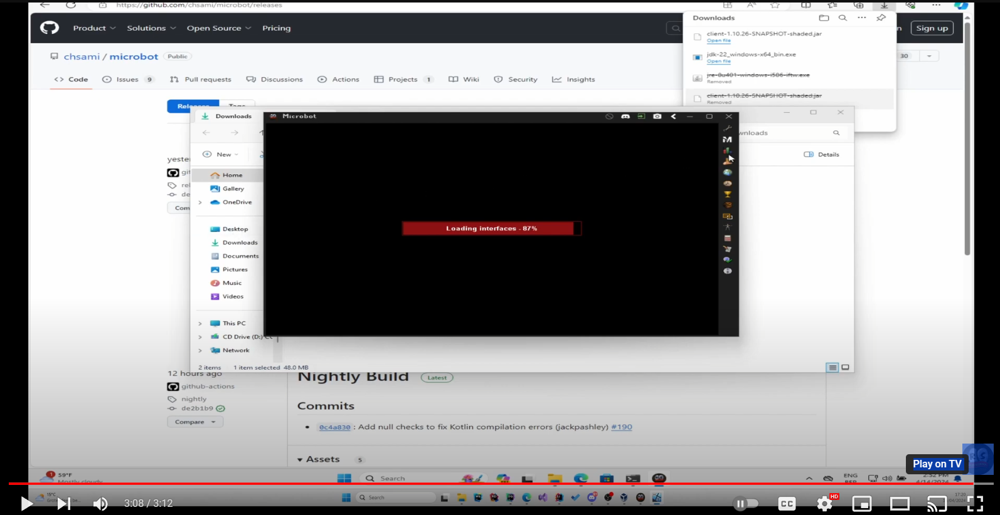
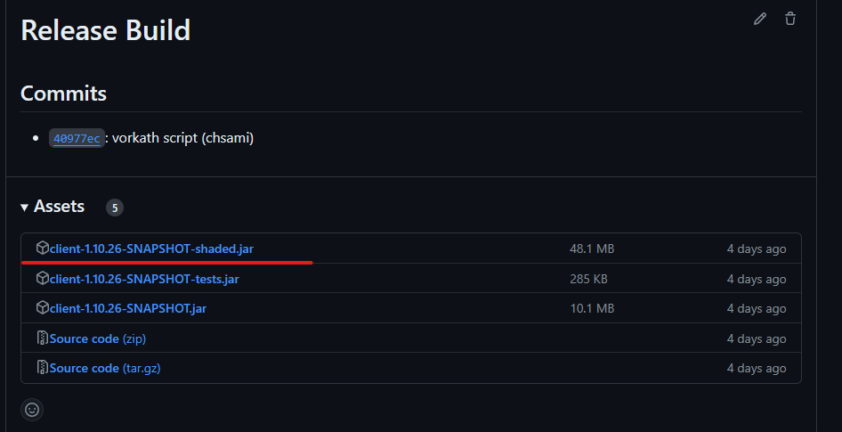

# Installation

### 1.Download the client & Java - Windows

You can visit https://github.com/chsami/microbot/releases and download the latest client snapshot **SHADED** release build.
You will also see nightly builds, these are unstable development builds, you can try them out if you want but we recommend you always use the release build to avoid any bugs

### 2.Jagex Account

Youtube video explaining microbot with jagex accounts: https://www.youtube.com/watch?v=ga-lg1oAnhM

If you don't have java installed yet, watch the youtube video: https://www.youtube.com/watch?v=EbtdZnxq5iw

1) Simply login with the jagex launcher for the first time. This will create a token for your account. Close everything after succesfully login in through the jagex launcher.
2) Open the shaded.jar from microbot and this should prompt you with the jagex account to login.

### 3.Jagex Launcher

If you don't have java installed yet, watch the youtube video: https://www.youtube.com/watch?v=EbtdZnxq5iw

Simply replace the Official RuneLite.jar with the microbot.jar and make sure the name is the same!! After that you can start up the jagex launcher and select runelite, this will startup microbot.

### 4.Run Microbot on Linux

* Make sure you have Java installed, get it from your package manager. Run the "shaded" .jar from the nightly build with java --jar client-1.10.26-SNAPSHOT-shaded.jar
* If you have a Jagex account, download and run Bolt launcher (https://github.com/Adamcake/Bolt). After signing in, run the "shaded" .jar by enabling "Use custom RuneLite JAR" and navigating to the Microbot .jar.
* Download and extract the RuneLite AppImage. Replace RuneLite.jar with the Microbot one. Run RuneLite

**Are you stuck? Join our [Discord](https://discord.gg/zaGrfqFEWE) server.**